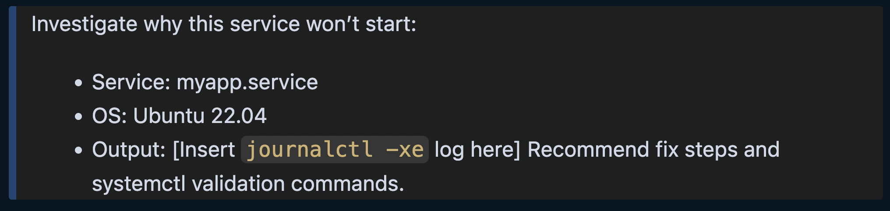

# AI Prompts for Linux OS Troubleshooting & Automation

**When Linux goes wrong, AI can help make it right — faster.**

It was 11:32 PM when Sofia got a Slack ping from the backend team: "The app’s offline — seems like a file permission issue on one of the servers. Can you take a look?"

She SSH’d in, ran a few commands, and stared at the logs. Nothing obvious. Just noise. Ten minutes passed. Then twenty. Still no clear root cause.

The next morning, Sofia discovered a better way: using AI to structure her troubleshooting. Prompts that didn’t just help her fix issues — but helped her understand, automate, and document the fix.

Here are 15 AI-powered prompts to help any Linux-savvy DevOps engineer or SRE get to the root of problems faster — and automate the ones they never want to deal with again.

---

## 1. File Permissions & Ownership
> Diagnose this Linux file access issue:
> - User: deploy
> - File: /var/www/html/app/config.yaml
> - Symptoms: "Permission denied" error on deployment
> Include: recommended chmod/chown fix, and explanation.

## 2. Disk Space Debugging
> Analyze disk usage from `df -h` and `du -sh /*` output:
> - Recommend cleanup steps
> - Suggest automated alert thresholds

## 3. Cron Job Failures
> Help debug a failed cron job:
> - Command: `/usr/local/bin/db_backup.sh`
> - Schedule: every day at 2AM
> - Logs show no execution since Sunday
> What should I check? Suggest a health check script.

## 4. Systemd Service Troubleshooting
> Investigate why this service won’t start:
> - Service: myapp.service
> - OS: Ubuntu 22.04
> - Output: [Insert `journalctl -xe` log here]
> Recommend fix steps and systemctl validation commands.

## 5. Slow Boot Investigation
> Diagnose slow boot time on a Linux system:
> - Distro: CentOS 7
> - Tool: systemd-analyze
> Provide optimization tips.

## 6. High CPU Usage
> Analyze `top` and `htop` output:
> - Service: apache2
> - CPU spike to 99%
> What could cause this and how to mitigate it?

## 7. Memory Leak Diagnosis
> Memory usage grows constantly.
> Tool: `free -m`, `vmstat`, `top`
> Suggest ways to identify memory leaks in running apps.

## 8. SELinux Blocking Troubleshooting
> Identify and resolve SELinux denial:
> - Distro: RHEL 8
> - Logs: audit.log entries show AVC denial
> Include fix with `semanage` or `restorecon`

## 9. SSH Connectivity Issues
> Debug SSH connection issue:
> - Error: "Connection refused"
> - OS: Ubuntu 20.04
> - Port 22 open
> Provide possible causes and test strategies.

## 10. Automate User Management
> Generate a Bash script to:
> - Add a new user
> - Add to sudoers
> - Set strong password policy
> - Force password change on first login

## 11. Log Rotation Configuration
> Create a logrotate config for:
> - File: /var/log/myapp/*.log
> - Rotate weekly, keep 4 backups
> - Compress logs after rotation

## 12. Uptime & Reboot Monitoring
> Write a shell script to:
> - Check uptime
> - Alert if system rebooted in the last 12 hours
> - Email notification using mailx or sendmail

## 13. Detect Unauthorized Changes
> Suggest a tool and setup to monitor:
> - File integrity (e.g., /etc/passwd)
> - Alert on changes
> - Include open-source tool recommendation

## 14. Kernel Panic Troubleshooting
> System crashed with kernel panic.
> - Distro: Debian 11
> - Logs: [Paste crash dump or screenshot]
> How to read this and where to start?

## 15. Network Configuration Debugging
> Network interface not getting IP:
> - OS: Ubuntu 22.04
> - Interface: ens33
> - Tool: `ip a`, `netplan`, `systemctl status NetworkManager`
> Recommend fix and how to test DHCP response.

---

These prompts are a starting point, but when tailored to your actual systems, they become time-saving, stress-reducing allies.

- [Explore on GitHub](https://github.com/Here2ServeU/DevOps-AI-Toolkit)

